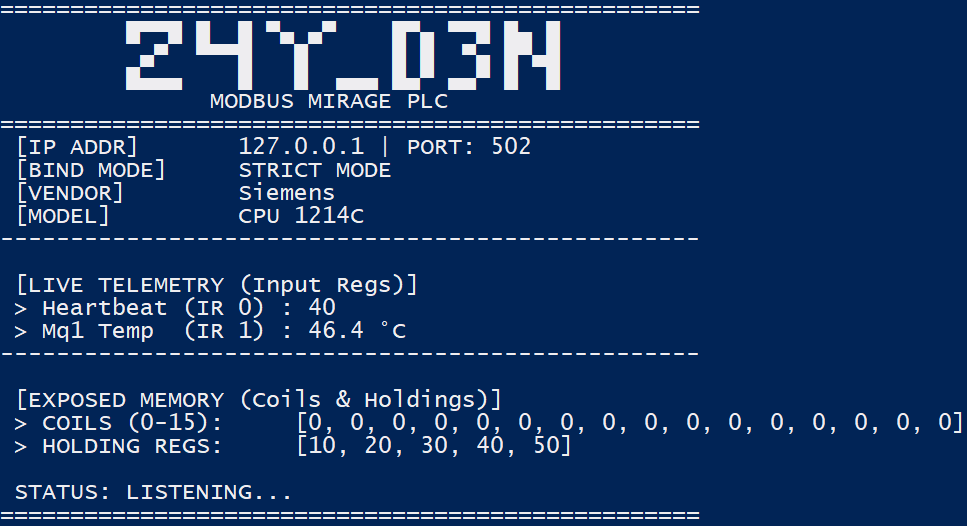
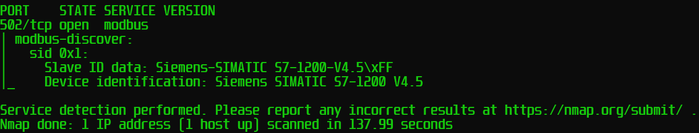

# Modbus Mirage PLC

## Overview
**Modbus Mirage** is a interactive, asynchronous Modbus TCP Virtual PLC simulator designed specifically for Operational Technology (OT) and Industrial Control Systems (ICS) security learning.

Unlike static honeypots, Modbus Mirage actively generates real-time telemetry data (such as fluctuating temperatures and system pulses) to provide a more realistic attack surface. It mimics the identity of a Siemens SIMATIC S7-1200 CPU (customizable within the code), providing users with a reliable target for practicing security audits using deep packet inspection (DPI), validating IDS/IPS rules, and tactical exploitation of the Modbus TCP protocol.

## Legal Disclaimer and Terms of Use
This software is provided strictly for authorized security auditing, academic research, and defensive engineering. The author assumes no liability for misuse, unauthorized access, or deployment in production environments without proper segregation. Deploying honeypots or decoy systems on live OT networks without explicit authorization poses severe operational risks.

## Intended Use Cases
* **IDS/IPS Rule Validation:** Testing Snort/Suricata rules against Modbus TCP functions (e.g., Read Holding Registers, Write Single Coil) by generating realistic traffic against the simulator.
* **OT Honeypots:** Deploying a decoy PLC in an enterprise network to detect lateral movement, unauthorized reconnaissance (e.g., Nmap scans), or exploitation attempts.
* **Tool Development:** Acting as a reliable, local testing endpoint for developers creating custom ICS vulnerability scanners or protocol fuzzers.

## Core Capabilities
* **Live Telemetry Engine:** Continuously updates Input Registers with a live Heartbeat counter and dynamically fluctuating temperature values to defeat basic static-analysis fingerprinting.
* **Strict Memory Binding:** Fully aligns block memory with 0-based indexing to ensure perfect compatibility with external auditing tools and hardware scanners.
* **Cross-Platform & Headless Support:** Runs seamlessly on Windows, Linux, or macOS. Includes an interactive console UI with "Anti-flicker" technology, as well as a completely headless mode for background daemon execution.
* **Device Impersonation:** Responds to Modbus Device Identification requests (Function 43/14) with legitimate Vendor, Product Code, and Revision metadata.

## OT Memory Map (Attack Surface)
Security auditors and attackers can interact with the following exposed memory regions:

| Area | Function Code (Read/Write) | Address | Data Type | Description / Purpose |
| :--- | :--- | :--- | :--- | :--- |
| **Input Registers (IR)** | `04` (Read Only) | `0` | INT16 | **System Heartbeat:** Increments continuously. |
| **Input Registers (IR)** | `04` (Read Only) | `1` | INT16 | **Machine 1 Temp:** Fluctuates around 45.0 °C. |
| **Coils (CO)** | `01` / `05` / `15` | `0` to `15` | BOOL | **Actuators:** Interactive binary inputs (Valves, Motors). |
| **Holding Registers (HR)** | `03` / `06` / `16` | `0` to `4` | INT16 | **Process Setpoints:** Read/Write static memory for DB manipulation testing. |

---

## Installation and Deployment

### Option A: Docker Deployment (Recommended for Labs)
The easiest way to deploy Modbus Mirage in isolated environments or virtual networks.

1. Clone the repository and navigate to the directory.
2. Build and start the container in the background: `docker-compose up -d`
3. The virtual PLC is now listening on port `502`. To view the live logs (if running without the `--quiet` flag), use: `docker logs -f modbus_mirage_s7`.

### Option B: Native Python Execution
For local development or running directly on hardware like a Raspberry Pi.

1. Install the required asynchronous dependencies: `pip install -r requirements.txt`

2. Execute the script: `python modbus_mirage.py`

**Note: On Linux/macOS, binding to port 502 requires root privileges:** `sudo python modbus_mirage.py`

---

## Interface and CLI Usage

Modbus Mirage features a dual-mode execution strategy:

### 1. Interactive Mode
If you run the script without any arguments (`sudo python modbus_mirage.py`), it launches a tactical CLI interface. It will automatically scan your host for available network interfaces, prompt you to select a Bind IP, and deploy a live UI updating the telemetry in real-time.

### 2. Automated / Headless Mode (CLI Parsers)
For deployment in bash scripts, startup routines, or automated labs, use the built-in argument parsers to bypass the interactive prompt.

| Argument | Short | Description | Example |
| :--- | :---: | :--- | :--- |
| `--ip` | `-i` | Force the Bind IP address. | `-i 127.0.0.1` |
| `--port` | `-p` | Override the default Modbus port. | `-p 502` |
| `--quiet` | `-q` | Disable the console UI for silent background execution. | `-q` |

**Example (Headless execution on a custom port):**
`sudo python modbus_mirage.py -i 0.0.0.0 -p 5020 --quiet`

---

## Proof of Concept: Discovery Scanning
Once deployed, the simulator accurately responds to standard ICS enumeration tactics. Running an Nmap Modbus Discovery script (`nmap -sV -p 502 --script modbus-discover 127.0.0.1`) will yield the following output:

## License
This project is licensed under the GNU General Public License v3.0. See the `LICENSE` file for full details.

## Author
**z4y_d3n**
* GitHub: https://github.com/z4y-d3n